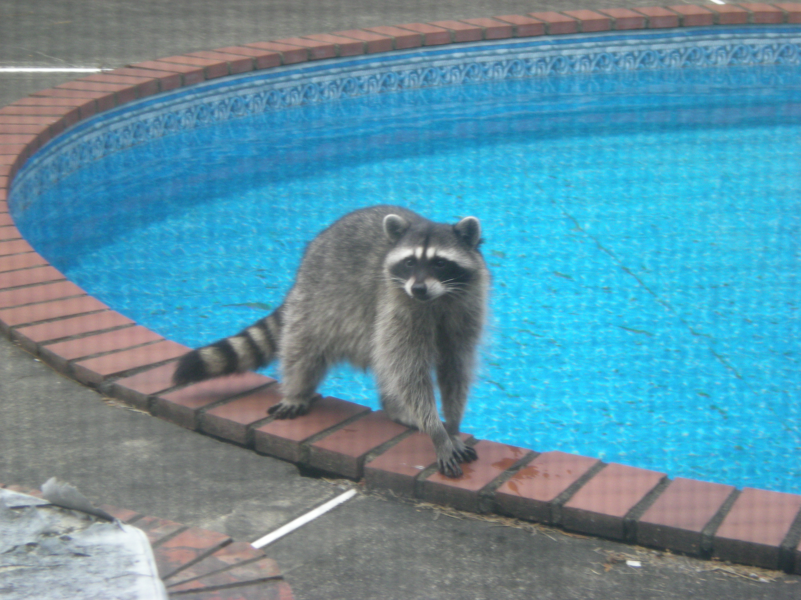

# This is Jeff's awesome website


## Subsection

Add some text here

```{r}
rnorm(10)
```

## Links

Link to useful sites for data science

* [Google](https://www.google.com/)
* [P8105](https://p8105.com)

## Local image


## link to page within the site

[About me](about.html)
